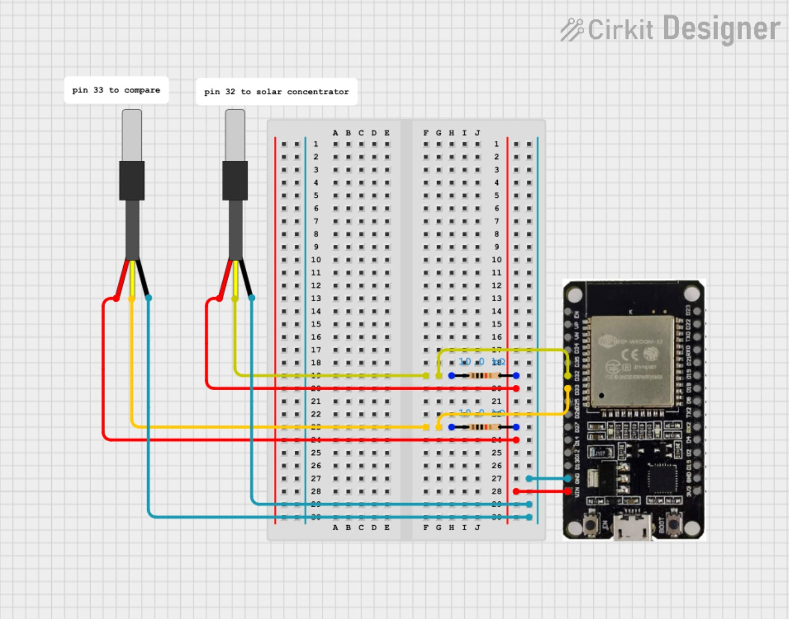

# ssc-201-temp-monitor
This repo contains code to remote monitor temperature sensor readings and automatically logging data to database.

This repo uses free tier HiveMQ Cloud as the MQTT broker, and free tier MongoDB Atlas as the database.

This setup is tested to work on Windows 11. 

## Hardware Setup

The gadgets used here are ESP-WROOM32 board and DS18B20 sensors.

## Publisher (esp-mqtt)
ESP32 publishes readings from temperature sensors to a topic named "thermocouple-readings" on MQTT broker.

Note that the Arduino code uses libraries that need to be manually installed into the Arduino IDE.

### Fill in config.h
Sensitive information, including WiFi name and password, MQTT server URL, and MQTT username and password, are to be written in config.h file, which is git-ignored for privacy reasons. Please copy the file config_template.h and save as config.h under the esp-mqtt folder, and fill in the credentials accordingly for actual use. 

### Other Notes
This setup is set to sense and publish message only during daytime 0700~1900, because this project is about solar power. 

If the temperature reading is -127 C, it often suggests that sensor connection is bad. The board is set to reboot if a few of -127s are read, to try to re-establish connection. If the -127s persist, maybe the sensors are not working. 

## Subscriber (laptop-mqtt)
A subscriber is run on laptop using Python script. It reads the published messages on the broker in real time, rearrange the data format, and forward to MongoDB database. 

Note that paho-mqtt library is needed. Installation can be done using `pip install paho-mqtt` in console. 

### Fill in config.py
Similar to the publisher, copy the config_template.py as config.py and fill in the actual credentials for database connection. 

### Data File
Use MongoDBCompass to connect to the database, and download the .csv files for each collection. 
